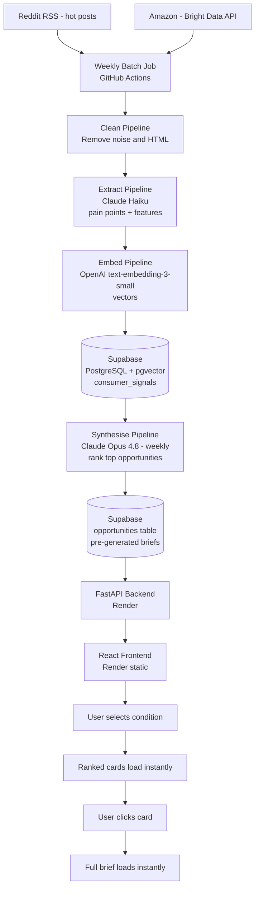

# Threadline

> Threadline turns consumer frustration into product briefs before a brand runs a focus group.

---

## What is Threadline?

Threadline is a web application that helps product managers at adaptive fashion brands discover what to build next — grounded in real consumer signals from Reddit and Amazon.

A brand PM opens Threadline, selects a condition (post-mastectomy, ostomy, rheumatoid arthritis, or post-surgical recovery), and immediately sees pre-generated ranked product opportunities. Everything loads instantly — no waiting, no forms, no pre-formed idea required.

- The **top ranked product opportunities** for that condition — grounded in real consumer posts and reviews
- A **full product brief** for any opportunity — confirmed pain points, recommended features, what to build first
- **Cross-condition overlap** — when the same unmet need appears across multiple conditions, Threadline flags it automatically

---

## Who is it for?

- **Product managers** at adaptive fashion brands (Tommy Hilfiger Adaptive, Silverts, Reboundwear, and others) who need to know what to build next before committing to a development cycle
- **Founders and startups** entering adaptive fashion for the first time who need to validate a market opportunity before investing in it
- **Design researchers and strategists** working with brands in this space

---

## Conditions covered at launch

| Condition | Data sources |
|---|---|
| Post-mastectomy / breast cancer recovery | r/breastcancer, r/mastectomy, r/BRCA + Amazon reviews |
| Ostomy | r/ostomy, r/CrohnsDisease, r/UlcerativeColitis + Amazon reviews |
| Rheumatoid arthritis / mobility limitations | r/rheumatoid, r/ChronicPain, r/arthritis + Amazon reviews |
| Post-surgical recovery (general) | r/PostOpRecovery, r/plasticsurgery + Amazon reviews |

---

## How it works



1. A weekly scraper pulls hot posts from Reddit and reviews from Amazon via Bright Data
2. A cleaning pipeline removes HTML, noise, and salutations from each record
3. Claude Haiku extracts pain points and product features from each cleaned record
4. OpenAI embeddings convert each record into a vector for semantic search
5. Claude Opus 4.8 synthesises all signals weekly into ranked product opportunities and full briefs
6. Everything is stored in Supabase — users see instant results, no on-demand LLM calls

---

## Tech stack

| Layer | Tool |
|---|---|
| Database | Supabase (PostgreSQL + pgvector) |
| Backend | FastAPI (Python) on Render |
| Frontend | React + Vite on Render |
| Scraping — Reddit | RSS feed (hot posts, no API key needed) |
| Scraping — Amazon | Bright Data API |
| AI — extraction | Claude Haiku (`claude-haiku-4-5-20251001`) |
| AI — synthesis | Claude Opus 4.8 (`claude-opus-4-8`) |
| AI — embeddings | OpenAI `text-embedding-3-small` |
| AI — chatbot (Phase 2) | Claude Sonnet 4.6 |
| Automation | GitHub Actions (weekly pipeline + Supabase keepalive) |

---

## Repository structure

```
threadline-app/
├── README.md
├── .gitignore
├── docs/
│   ├── product/
│   │   ├── product_vision.md
│   │   ├── user_flow.md
│   │   └── feature_spec.md
│   ├── architecture/
│   │   ├── architecture_spec.md
│   │   ├── data_schema.md
│   │   └── api_reference.md
│   ├── data/
│   │   ├── data_sources.md
│   │   ├── data_pipeline.md
│   │   └── prompt_library.md
│   ├── build/
│   │   ├── local_setup.md
│   │   ├── deployment.md
│   │   └── github_actions.md
│   └── decisions_log.md
├── scraper/
│   ├── reddit_scraper.py
│   ├── huggingface_loader.py
│   ├── cleaner.py
│   ├── extractor.py
│   ├── embedder.py
│   ├── synthesiser.py
│   └── pipeline.py
├── backend/
├── frontend/
└── .github/
    └── workflows/
        ├── pipeline.yml
        └── keepalive.yml
```

---

## Documentation

| Document | What it covers |
|---|---|
| [product_vision.md](docs/product/product_vision.md) | What Threadline is, who it's for, and why it exists |
| [user_flow.md](docs/product/user_flow.md) | Full user experience from landing to output |
| [feature_spec.md](docs/product/feature_spec.md) | Every feature defined precisely |
| [architecture_spec.md](docs/architecture/architecture_spec.md) | System architecture and all technical decisions |
| [data_schema.md](docs/architecture/data_schema.md) | Full database schema |

---

## Status

Active development. Data pipeline complete → backend → frontend in progress.

---

## Author

Raksha Krishna Moorthy
MS Information Systems, Northeastern University
github.com/rakshakmoorthy
