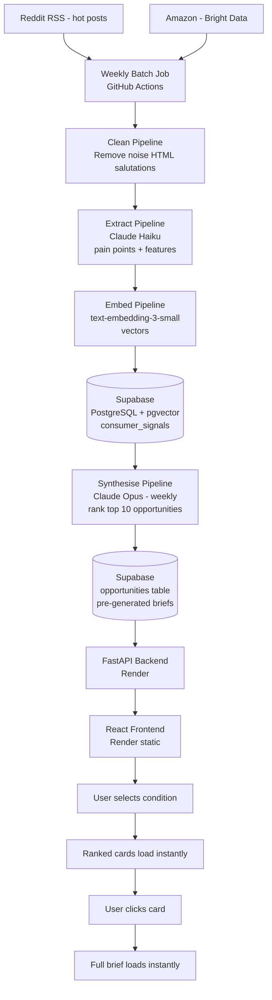

# Threadline — Technical Architecture Specification

**Version:** 3.0 (rebuilt from friend's architectural recommendations)
**Status:** Approved for build  
**Last updated:** July 2, 2026  
**Author:** Raksha Krishna Moorthy  

---

## 1. Product Overview

Threadline is an AI-powered market intelligence web application for the adaptive fashion market.

A brand PM selects one or more conditions and instantly sees pre-generated ranked product opportunities grounded in real consumer signals from Reddit and Amazon. They click any opportunity to get a full product brief — confirmed pain points, recommended features, priority order, gaps, and source evidence. Everything loads instantly — no waiting, no on-demand LLM calls.

**Target conditions at launch:**
- Post-mastectomy / breast cancer recovery
- Ostomy
- Rheumatoid arthritis / mobility limitations
- Post-surgical recovery (general)

**Target user:** Product managers at adaptive fashion brands who need to know what to build next.

---

## 2. Core Architecture Principle

> Use the right model for the right task.

Heavy models (Claude Opus) run once a week in a batch job and pre-generate all opportunities. Users never trigger expensive model calls — they read from a database. This makes the product fast, cheap, and scalable.

---

## 3. System Architecture Overview



---

## 4. Pipeline Design

### Stage 1 — Scrape

| Source | Method | What we collect | Frequency |
|---|---|---|---|
| Reddit | RSS feed (hot posts only) | Post title + body from target subreddits | Weekly |
| Amazon | Bright Data API | Review text, rating, verified purchase status | Weekly |

**Reddit — hot posts only.**
Hot posts have the most upvotes and comments — highest signal quality. New posts are too noisy. Top posts are too old.

**Target subreddits:**

| Condition | Subreddits |
|---|---|
| Post-mastectomy | r/breastcancer, r/mastectomy, r/BRCA |
| Ostomy | r/ostomy, r/CrohnsDisease, r/UlcerativeColitis |
| Rheumatoid | r/rheumatoid, r/ChronicPain, r/arthritis |
| Post-surgical | r/PostOpRecovery, r/plasticsurgery |

**Amazon — Bright Data API (free tier: 5,000 records/month)**
Sends ASINs, gets structured review JSON back. Handles proxies and CAPTCHAs automatically.

---

### Stage 2 — Clean

Before any LLM touches the data, clean it. Dirty input = poor extraction = wasted tokens.

**What gets removed:**
- HTML tags and markdown formatting
- Salutations ("Hi everyone", "Thanks so much", "Hope you're well")
- Deleted or removed post content ("[deleted]", "[removed]")
- Posts under 20 words
- Off-topic content (no clothing or adaptive fashion keywords)

**Output:** `clean_text` stored in `consumer_signals` table alongside `raw_text`.

---

### Stage 3 — Extract (Claude Haiku)

Claude Haiku reads each `clean_text` and extracts structured data.

**Why Haiku:** Cheap, fast, runs on every record. Good enough for structured extraction from short consumer text.

**Model:** `claude-haiku-4-5-20251001` — $1.00 input / $5.00 output per million tokens. Use Batch API for 50% discount since extraction is not time-sensitive.

**Input:** `clean_text`

**Output:**
```json
{
  "pain_points": [
    "Cannot fasten back closures with limited arm mobility",
    "Standard bras cause discomfort against surgical drain sites"
  ],
  "mentioned_features": [
    "front closure",
    "magnetic buttons",
    "soft cotton",
    "drain pocket"
  ],
  "sentiment": "negative"
}
```

Stored back into `consumer_signals.pain_points`, `consumer_signals.mentioned_features`, `consumer_signals.sentiment`.

---

### Stage 4 — Embed

**Model:** OpenAI `text-embedding-3-small` (working assumption — not yet confirmed)
**Input:** `clean_text`
**Output:** `VECTOR(1536)` stored in `consumer_signals.embedding`

Embeddings enable semantic search — finding records by meaning, not just keywords. Used by the synthesis pipeline to cluster related signals.

---

### Stage 5 — Synthesise (Claude Opus — once a week)

The most powerful and expensive step. Runs once a week — not on every user click.

**Why Opus:** Best reasoning capability for synthesising hundreds of signals into ranked, nuanced product opportunities.

**Model:** `claude-opus-4-8` — $5.00 input / $25.00 output per million tokens. Use Batch API (50% discount) since synthesis runs weekly, not in real time. Effective cost: $2.50/$12.50 per million tokens.

**Input:**
- All `consumer_signals` records for a condition, grouped by embedding clusters
- Extracted pain points and features from each record

**Output per condition:** Top 10 ranked product opportunities, each with:
- Product idea title
- Signal strength score (0–100)
- Confidence level (High / Medium / Low)
- Top pain point summary (one line)
- Full product brief (pain points, features, priority, gaps)
- Source evidence (sample Reddit posts and Amazon reviews)

**Output stored in:** `opportunities` table in Supabase

---

## 5. User Experience (Instant Load)

Once opportunities are pre-generated and stored, the user experience requires no LLM calls:

```
User selects condition(s)
        ↓
FastAPI queries opportunities table
        ↓
Ranked cards return instantly from DB
        ↓
User clicks a card
        ↓
Full brief returns instantly from DB
```

No waiting. No spinning. No 30-second LLM generation on click.

---

## 6. Database Schema

### Table: `consumer_signals`

| Column | Type | Description |
|---|---|---|
| `id` | UUID (PK) | Unique record ID |
| `source` | TEXT | `reddit` or `amazon` |
| `source_url` | TEXT | Original post/review URL |
| `source_id` | TEXT | Unique ID for deduplication |
| `condition` | TEXT | One of the four launch conditions |
| `raw_text` | TEXT | Original unmodified text |
| `clean_text` | TEXT | Cleaned text — HTML removed, salutations removed |
| `pain_points` | JSONB | Extracted pain points array (Haiku output) |
| `mentioned_features` | JSONB | Product features mentioned |
| `sentiment` | TEXT | `positive`, `negative`, `mixed` |
| `upvotes` | INTEGER | Reddit upvotes or Amazon helpfulness votes |
| `embedding` | VECTOR(1536) | Semantic embedding |
| `scraped_at` | TIMESTAMP | When collected |
| `created_at` | TIMESTAMP | DB insert time |

### Table: `opportunities`

Pre-generated weekly by Claude Opus. Read directly by the frontend via FastAPI.

| Column | Type | Description |
|---|---|---|
| `id` | UUID (PK) | Unique opportunity ID |
| `condition` | TEXT | Primary condition |
| `conditions` | TEXT[] | All conditions this applies to (for overlap) |
| `title` | TEXT | Product idea title |
| `score` | INTEGER | Signal strength score 0–100 |
| `confidence` | TEXT | `high`, `medium`, `low` |
| `pain_point_summary` | TEXT | One-line top pain point |
| `brief` | JSONB | Full product brief |
| `signal_ids` | UUID[] | Which consumer_signals drove this |
| `overlap` | BOOLEAN | True if appears across multiple conditions |
| `generated_at` | TIMESTAMP | When this was generated |

### Table: `keepalive`

| Column | Type | Description |
|---|---|---|
| `id` | SERIAL (PK) | Auto-increment |
| `pinged_at` | TIMESTAMP | When the ping ran |

---

## 7. API Design (FastAPI)

All data flows through FastAPI. Frontend never calls Supabase or Claude directly.

### `GET /opportunities`

Returns pre-generated ranked opportunities for selected conditions.

**Request:**
```
GET /opportunities?conditions=post_mastectomy,ostomy
```

**Response:**
```json
{
  "opportunities": [
    {
      "id": "uuid",
      "title": "Front-closure adaptive top",
      "score": 87,
      "confidence": "high",
      "pain_point_summary": "Cannot fasten standard closures post-surgery",
      "conditions": ["post_mastectomy", "post_surgical"],
      "overlap": true
    }
  ],
  "total": 10,
  "generated_at": "2026-07-02T02:00:00Z"
}
```

### `GET /opportunities/{id}`

Returns the full pre-generated product brief for a specific opportunity.

### `GET /conditions`

Returns supported conditions and record counts.

### `GET /health`

Returns API status. Used by keep-alive ping.

### `POST /chat` *(Phase 2)*

Chatbot endpoint. Vector search + Claude Sonnet. Answers questions grounded in consumer_signals data.

---

## 8. Hosting Stack (verified)

| Layer | Service | Plan | Cost |
|---|---|---|---|
| Database | Supabase | Free | $0 |
| Vector search | pgvector (built in) | Included | $0 |
| Backend | Render web service | Free → Starter before demos | $0–$7/mo |
| Frontend | Render static site | Free | $0 |
| Scraper + batch job | GitHub Actions | Free (public repo) | $0 |
| Amazon scraping | Bright Data | Free tier (5k records/mo) | $0 |
| AI — extraction | Claude Haiku | Pay per token | ~$0.50/mo |
| AI — synthesis | Claude Opus (TBD) | Pay per token | ~$2–5/mo |
| AI — embeddings | OpenAI text-embedding-3-small | Pay per token | ~$0.50/mo |
| AI — chatbot (Phase 2) | Claude Sonnet | Pay per token | ~$1–3/mo |
| **Total** | | | **~$3–15/mo** |

---

## 9. Build Order

```
Phase 1 — Foundation ✓ COMPLETE
  Supabase setup, schema, pgvector
  GitHub repo + initial docs
  Initial data load (2,321 records)

Phase 2 — Data Pipeline (current)
  Step 2.1  Update Reddit scraper → hot posts only
  Step 2.2  Set up Bright Data → live Amazon reviews
  Step 2.3  Build cleaning pipeline
  Step 2.4  Build extraction pipeline (Claude Haiku)
  Step 2.5  Build embedding pipeline
  Step 2.6  Build weekly synthesis job (Claude Opus — model TBD)
  Step 2.7  Add clean_text column to consumer_signals
  Step 2.8  Set up GitHub Actions workflows
  Step 2.9  Verify full pipeline end to end

Phase 3 — Backend
  Step 3.1  FastAPI project structure
  Step 3.2  GET /opportunities endpoint
  Step 3.3  GET /opportunities/{id} endpoint
  Step 3.4  GET /conditions + GET /health endpoints
  Step 3.5  Test locally
  Step 3.6  Deploy to Render

Phase 4 — Frontend
  Step 4.1  React + Vite setup
  Step 4.2  Dark PM dashboard layout
  Step 4.3  Condition selector
  Step 4.4  Ranked opportunity cards (instant load)
  Step 4.5  Full product brief (instant load)
  Step 4.6  Cross-condition overlap flagging
  Step 4.7  Deploy to Render static site

Phase 5 — Polish + Phase 2 Features
  Step 5.1  Error + loading states
  Step 5.2  Mobile responsiveness
  Step 5.3  Backend keep-alive before demos
  Step 5.4  Talk with reports — chatbot + visualisations (Claude Sonnet)
  Step 5.5  Proactive insight suggestions
  Step 5.6  Complete remaining docs
```

---

## 10. Repository Structure

```
threadline-app/
├── README.md
├── .gitignore
├── docs/
│   ├── product/
│   │   ├── product_vision.md
│   │   ├── user_flow.md
│   │   └── feature_spec.md
│   ├── architecture/
│   │   ├── architecture_spec.md
│   │   ├── data_schema.md
│   │   └── api_reference.md
│   ├── data/
│   │   ├── data_sources.md
│   │   ├── data_pipeline.md
│   │   └── prompt_library.md
│   ├── build/
│   │   ├── local_setup.md
│   │   ├── deployment.md
│   │   └── github_actions.md
│   └── decisions_log.md
├── scraper/
│   ├── reddit_scraper.py
│   ├── amazon_scraper.py (Bright Data)
│   ├── cleaner.py
│   ├── extractor.py (Claude Haiku)
│   ├── embedder.py
│   ├── synthesiser.py (Claude Opus)
│   ├── pipeline.py
│   └── requirements.txt
├── backend/
│   ├── main.py
│   ├── routes/
│   │   ├── opportunities.py
│   │   ├── conditions.py
│   │   ├── health.py
│   │   └── chat.py (Phase 2)
│   ├── services/
│   │   ├── supabase_client.py
│   │   └── claude_client.py
│   ├── prompts/
│   │   ├── extraction_prompt.py
│   │   └── synthesis_prompt.py
│   └── requirements.txt
├── frontend/
│   ├── src/
│   │   ├── App.jsx
│   │   ├── components/
│   │   │   ├── ConditionSelector.jsx
│   │   │   ├── OpportunityCard.jsx
│   │   │   ├── OpportunityList.jsx
│   │   │   ├── ProductBrief.jsx
│   │   │   ├── EvidencePanel.jsx
│   │   │   └── Chatbot.jsx (Phase 2)
│   │   └── api/
│   │       └── threadline.js
│   ├── index.html
│   └── package.json
└── .github/
    └── workflows/
        ├── pipeline.yml (weekly batch job)
        └── keepalive.yml
```

---

## 11. Open Questions

| # | Question | Decision needed by |
|---|---|---|
| 1 | Confirm Batch API setup for Haiku extraction + Opus synthesis | Step 2.4 |
| 2 | Which embedding model — OpenAI text-embedding-3-small confirmed? | Step 2.5 |
| 3 | How many opportunities to pre-generate per condition? (Top 10 is working assumption) | Step 2.6 |
| 4 | Does brief open as new page or expanded panel? | Step 4.5 |
| 5 | Backend keep-alive — Uptime Robot or GitHub Actions ping? | Step 5.3 |

---

## 12. Key Decisions

| Decision | What | Rationale |
|---|---|---|
| Pre-generate opportunities | Weekly batch, not on-demand | Instant UX, lower cost, scalable |
| Claude Haiku for extraction | Lightweight model per record | Cheap, fast, sufficient for structured extraction |
| Claude Opus 4.8 for synthesis | Heavy model weekly via Batch API | Best reasoning; Batch API cuts cost 50% |
| Hot posts only (Reddit) | Not new or top | Highest signal quality — upvoted by community |
| Bright Data for Amazon | Paid scraping API | Direct HTTP blocked; Bright Data handles proxies |
| All data through FastAPI | No direct frontend → Supabase | Protects API keys |
| Talk with reports | Phase 2 | Build core product first |
| One repo | threadline-app | Simpler at this project size |
| Public GitHub repo | Not private | Unlimited free Actions minutes |
