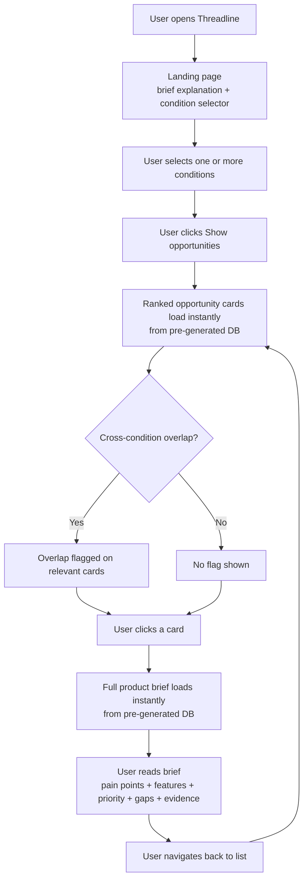

# Threadline — User Flow

**Version:** 2.0  
**Status:** Approved for build  
**Last updated:** July 2, 2026  

---

## Overview

This document describes the full experience a user has from the moment they open Threadline to the moment they leave with a product idea they are confident in.

The flow has four stages at launch, with a fifth coming in Phase 2:

```
1. Landing       → user understands what Threadline does
2. Selection     → user picks one or more conditions
3. Discovery     → user sees ranked product opportunities instantly
4. Brief         → user clicks into a full product brief instantly
5. Chat (Phase 2) → user asks questions and sees visualisations
```

---

## How results work — important

All product opportunities and briefs are **pre-generated weekly** by Claude Opus 4.8 and stored in the database. When a user selects a condition, results load instantly from the database — there is no LLM call, no waiting, no spinning.

This is intentional. Generating reports on-demand would make users wait 10–30 seconds. Pre-generation means instant load every time.

---

## Stage 1 — Landing

**What the user sees:**

A clean page with two elements:

1. A short explanation of what Threadline does — one or two sentences maximum:
   > *"Threadline turns consumer frustration into product briefs before a brand runs a focus group."*

2. The condition selector immediately below — visible without scrolling

**What the user does:**

Reads the explanation, then moves directly to selecting a condition. There is no login, no sign-up, no barrier.

**Design principle:** The landing page should be simple enough that the user can move to results without friction.

---

## Stage 2 — Condition Selection

**What the user sees:**

Four condition options displayed as selectable cards:

- Post-mastectomy / breast cancer recovery
- Ostomy
- Rheumatoid arthritis / mobility limitations
- Post-surgical recovery (general)

**What the user does:**

Selects one or more conditions. Multiple selections are allowed.

**Behaviour:**

- Selected conditions are visually highlighted
- A "Show opportunities" button appears once at least one condition is selected
- If multiple conditions are selected, results include opportunities across all selected conditions with cross-condition overlap flagged where it exists

---

## Stage 3 — Discovery (Ranked Opportunities)

**What the user sees:**

A ranked list of pre-generated product opportunities. Results load instantly — no waiting.

Each opportunity card shows:

- **Product idea title** — specific and actionable (e.g. "Front-closure adaptive bra")
- **Signal strength score** — 0–100
- **Top pain point summary** — one line
- **Conditions** — which condition(s) this applies to

Cards are ranked by signal strength, highest first.

**Cross-condition overlap:**

Opportunities appearing across multiple conditions are flagged visually. This signals a larger market opportunity — the same need exists across more than one patient group.

**What the user does:**

Browses the ranked list. Clicks any card to open the full product brief.

**Edge cases:**

- If there is not enough data to generate reliable opportunities for a selected condition, Threadline shows an honest message rather than low-quality results
- If no cross-condition overlap exists, nothing is flagged — overlap is only surfaced when it genuinely exists

---

## Stage 4 — Product Brief

**What the user sees:**

A full pre-generated product brief. Loads instantly from the database.

**Header**
- Product idea title
- Signal strength score + confidence level (High / Medium / Low)
- Conditions this applies to

**Confirmed pain points**
- Specific consumer frustrations this product addresses
- Derived from real Reddit posts and Amazon reviews

**Recommended product features**
- Specific features consumers mention consistently
- Categories determined by what the data actually surfaces

**Priority features**
- What to build first, ranked by signal frequency

**Gaps**
- What the data does not yet tell us — honest about limits

**Source evidence**
- Sample Reddit posts and Amazon reviews that drove this brief
- Each source: platform, short excerpt, link to original

**What the user does:**

Reads the brief. Uses it to make a product decision. Can navigate back to the ranked list.

Cards the user has already read are visually distinct so they can track what they've seen.

---

## Stage 5 — Talk with Reports *(Phase 2)*

After launch, users will be able to ask questions directly about the data and see visualisations.

**Examples:**
- *"What's the most urgent product to build for ostomy patients?"*
- *"Do post-mastectomy and post-surgical patients share the same closure needs?"*
- *"What materials do rheumatoid patients mention most?"*

Claude Sonnet answers using the vector store as context — responses are grounded in real consumer signals, not general knowledge.

Threadline will also proactively surface actionable insights without the user asking.

---

## Full Flow Diagram



---

## What Threadline Does Not Ask the User to Do

- Type in a product idea
- Create an account (at launch)
- Fill in a form
- Wait for results to generate

---

## Open Questions

| # | Question | Decision needed by |
|---|---|---|
| 1 | How many opportunity cards shown by default — all or top N with show more? | Frontend build |
| 2 | Does the brief open as a new page or expanded panel? | Frontend build |
| 3 | Can the user change condition selection without going back to landing? | Frontend build |
